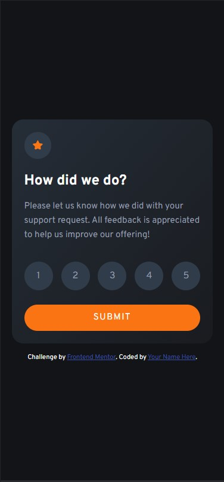
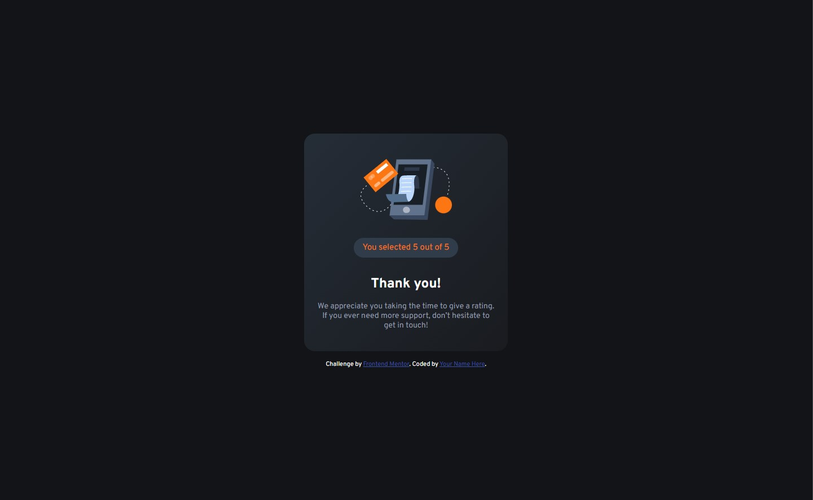

# Frontend Mentor - Interactive rating component solution

This is a solution to the [Interactive rating component challenge on Frontend Mentor](https://www.frontendmentor.io/challenges/interactive-rating-component-koxpeBUmI). Frontend Mentor challenges help you improve your coding skills by building realistic projects.

## Overview

### Screenshot

### Links

- Live Site URL: [Live site](https://interactive-rating-component-front-end-mentorr.netlify.app/)

### Built with

- Semantic HTML5 markup
- Sass custom properties
- Flexbox
- Mobile-first workflow

## Author

- Frontend Mentor - [@KrzysiekLu](https://www.frontendmentor.io/profile/KrzysiekLu)
